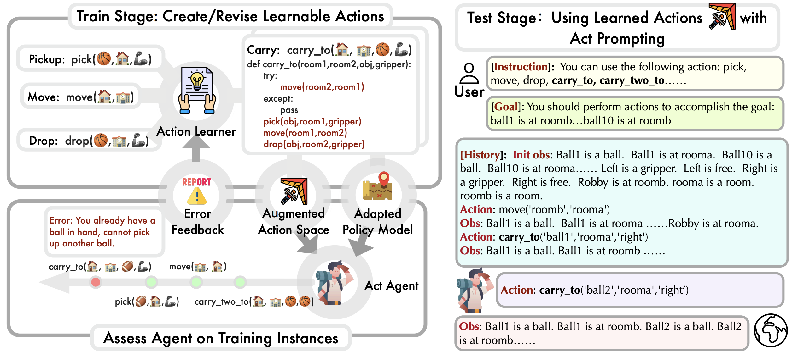

# LearnAct


This repository contains the code for the paper [**Empowering Large Language Model Agents through Action Learning**](https://arxiv.org/pdf/2402.15809.pdf).

LearnAct is a novel framework toward language agent action-level learning. It generates and iteratively updates learnable actions based on experience, enabling language agents to learn customized action space that better fits the LLM’s planning capacity. Below is an overview of the overall framework:



Left: During the training stage, LearnAct expands the action space by first creating actions and then optimizing them based on the execution feedback. Right: The test stage uses learned action space to facilitate sequential decision-making. The prompting format follows the Act agent.

Additionally, we benchmark several baselines, including ReAct, Reflection, and CodeAsPolicy, across various tasks such as AlfWorld and Robotic Planning.

## Installation
To run LearnAct, please clone the repository to your local machine and install the required dependencies using the script provided. The environment have been tested with `Python 3.9`. If you're using a different version of Python, you might need to adjust the versions of the packages accordingly.

### Environment
```
conda create -n env_learnact python=3.9

source activate env_learnact

pip install astor
pip install jsonlines
pip install astunparse

pip install pandas
pip install openai==0.28
pip install torch==1.13+cu117 torchaudio  -f https://download.pytorch.org/whl/cu117/torch_stable.html

pip install gym==0.26
pip install imageio
pip install gymnasium
pip install playwright==1.32.1
pip install Pillow
pip install types-tqdm
pip install tiktoken
pip install prompt_toolkit
pip install aiolimiter
pip install beartype==0.12.0
pip install minigrid==2.3.0
pip install nltk
pip install tenacity
pip install timeout-decorator
pip install gradio
pip install werkzeug==2.2.2
pip install gspread
pip install scikit-image
pip install geopy
pip install python-dotenv
pip install bs4
pip install scienceworld
pip install cmake

cd dataset
git clone https://github.com/alfworld/alfworld.git alfworld
cd alfworld
pip install -r requirements.txt
pip install -e .

export ALFWORLD_DATA=./
python scripts/alfworld-download
cd ..
cd ..
```


## Set OpenAI Key

To utilize GPT-4 and GPT-3.5 as language models in our experiments, an OpenAI API key is required. Please follow these steps to configure your environment:

1. Paste the value of your OpenAI API key into the file named `openai_keys.txt`.

2. Optionally, you can configure additional API settings in the file `downstream_test.py` as needed:

```python
# openai.api_type = "<your_api_type_here>"
# openai.api_base = "<your_api_base_url_here>"
# openai.api_version = "<your_api_version_here>"
```

## Run The Experiments

You can execute LearnAct on both Robotic Planning and AlfWorld tasks using the scripts provided. Run the following command to start an experiment:

```
bash run_experiment.sh $method $domain $agent_model_size
```

Where:

`$domain` specifies the task domain and accepts the values 

```
[robotic_planning, alfworld]
```

`$agent_model_size` determines the size of the agent model and can be either 

```
[gpt-4, gpt-3.5]
```

For instance, the command below:

```
bash run_experiment.sh learnact robotic_planning gpt-4
```

will execute LearnAct on Robotic Planning tasks using the GPT-4 model size.

In addition to our method LearnAct, this repository encompasses a variety of baseline methods. The `$method` parameter supports the following options: 

```
[learnact, act, react, act_reflexion, react_reflexion, code_as_policy]
```

Upon completion of the script execution:

If applicable (i.e., if the method involves learning), learning outcomes are saved in the **learn_results** folder.

Evaluation results are stored in the **eval_results** folder.


## Custom Development

This project leverages GPT as language model. You can integrate any other model by placing it within the `backbone/` directory. These models can then be loaded using the `load_backbone()` function, which is accessible in `model/get_model.py`.

Additionally, the pipeline is flexible, allowing for the integration of new methods or tasks. To achieve this, include your methods or tasks within the `model/` directory. Then, proceed to add the necessary arguments and ensure they are correctly loaded by modifying `model/model_arguments.py` and `model/get_model.py`. Specifically, for models that include a learning stage, you can manage both the learner and user models in `model/get_model.py`. Adjust their invocation in the `learn()` and `__call__()` methods as required. 

For extending tasks, similar steps apply: include the new arguments and their respective loading in `dataset/dataset_arguments.py` and `dataset/get_dataset.py`.

We hope you find our pipeline useful in facilitating the development of your projects.

## Acknowledge

The implementation of the tasks and agents are based on the repository https://github.com/hkust-nlp/AgentBoard/.

## Citation

Please cite our paper if you find it helpful.
```
@article{zhao2024empowering,
  title={Empowering Large Language Model Agents through Action Learning},
  author={Zhao, Haiteng and Ma, Chang and Wang, Guoyin and Su, Jing and Kong, Lingpeng and Xu, Jingjing and Deng, Zhi-Hong and Yang, Hongxia},
  journal={arXiv preprint arXiv:2402.15809},
  year={2024}
}
```


